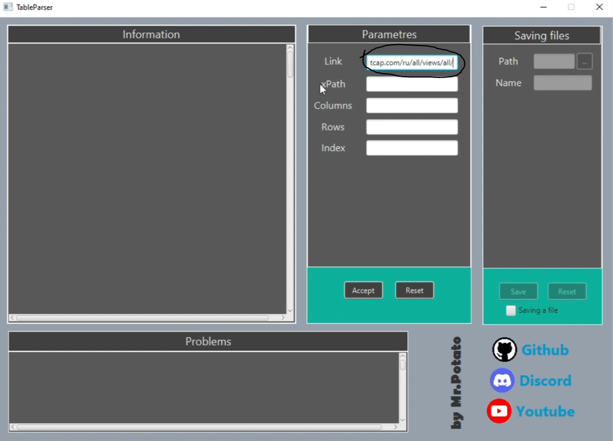
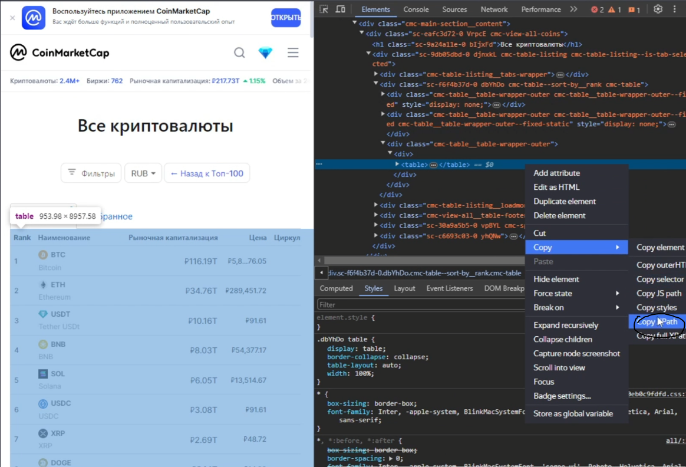
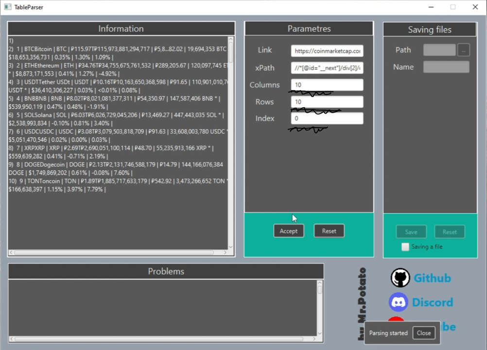
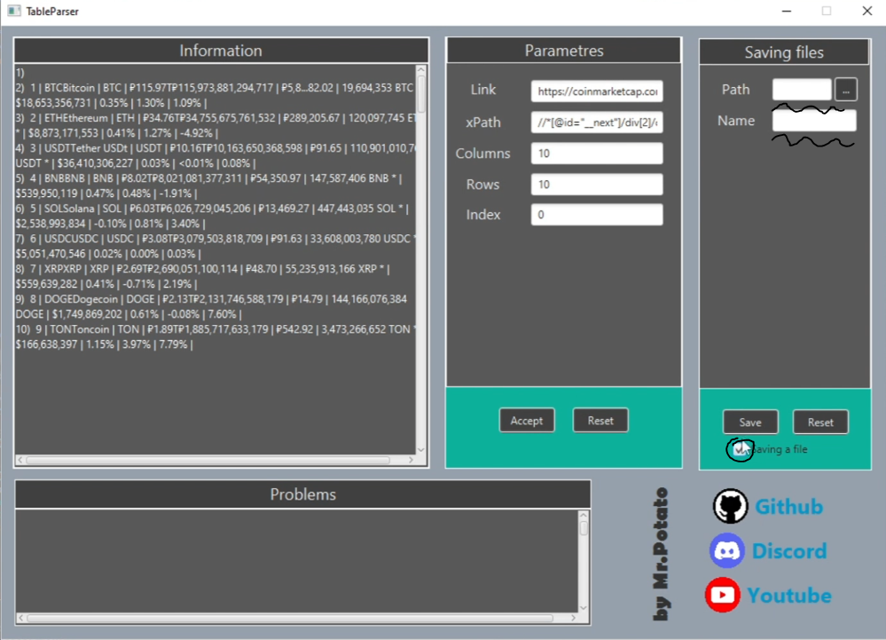
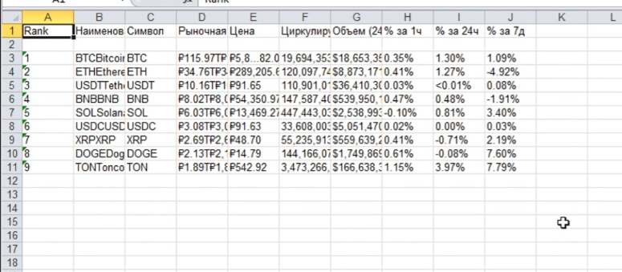

**Java Project: HTML Table Parser and Excel Converter**

This Java project is designed to extract tables from HTML web pages and convert them into Excel (XLSX) files. It allows users to specify the URL of a web page, an XPath expression to select the target table, and the number of rows and columns to extract.

**Usage:**

To use the project, you can follow these steps:

1. Clone the project repository or download the source code and install `java`(not under 17 version), you can install java from :point_right:[here](https://www.oracle.com/java/technologies/downloads/). And after that run the project using your preferred Java development environment. Or you can install java and open the file `Newbie_TableParser_jar3`.
2. After launching the application you need to configure the input parameters:
   - `reference`: The URL of the web page containing the HTML table.
   - `XPath`: The XPath expression to select the target HTML table. This target need to be `table` element.
   - `rows`: The number of rows to extract from the table.
   - `columns`: The number of columns to extract from the table.
   - `indexTableOnSite`: The index of the table to extract (if there are multiple tables on the web page). The index starts from 0. 
   - `PathOfSaveFile`: Optional path where the Excel file should be saved (if provided).
   - `nameOfSaveFile`: Optional name of the Excel file to be saved (if not provided, it defaults to "NewTable").

**Example:**

You can watch the [video](https://www.youtube.com/watch?v=gJ8k7nHG7TM)

Firstly, you need copy link of the site and paste in a field `link`:

Then you need copy the xpath of the table and paste in a field `xPath`:

After that you need enter count of columns, rows and index of the table(it starts from 0) and press the button `Accept`:

Finally, you need choose path of the excel file, name it and press the button `Save`:

Voilà:sparkles:

**Benefits:**

This project provides several benefits:

* **Data Extraction:** It allows you to easily extract tabular data from web pages for further analysis or processing.
* **Excel Compatibility:** The extracted data is converted into Excel format, which is widely used and compatible with various applications.